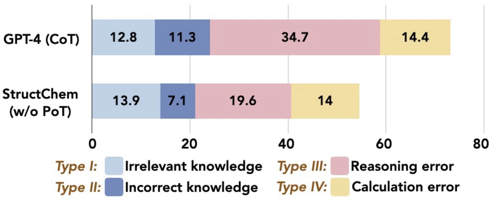
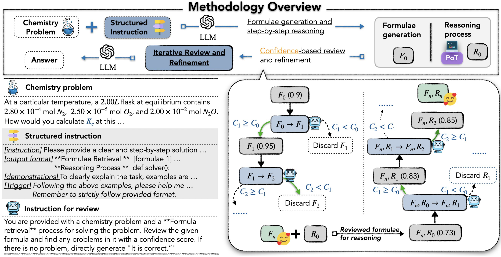

# Structured Chemistry Reasoning with Large Language Models
<p align="center">
  <a href="https://ozyyshr.github.io/StructChem/"></a>
  <a href="https://arxiv.org/abs/2311.09656"></a>
</p>

🖋 **Authors:** [Siru Ouyang](https://ozyyshr.github.io/), [Zhuosheng Zhang](https://bcmi.sjtu.edu.cn/~zhangzs/), [Bing Yan](https://bingyan.me/), [Xuan Liu](https://scholar.google.com/citations?user=XbtWYioAAAAJ&hl=en), [Yejin Choi](https://yzjiao.github.io/), [Yejin Choi](https://homes.cs.washington.edu/~yejin/), [Jiawei Han](https://hanj.cs.illinois.edu/), [Lianhui Qin](https://sites.google.com/view/lianhuiqin/home)

## 📜 Overview

Large Language Models (LLMs) excel in diverse areas, yet struggle with complex scientific reasoning, especially in the field of chemistry. The errors often stem not from a lack of domain knowledge within the LLMs, but rather from the absence of an effective reasoning structure that guides the LLMs to elicit the right knowledge, incorporate the knowledge in step-by-step reasoning, and iteratively refine results for further improved quality.

<p align="center">
    
</p>

We introduce StructChem, a simple yet effective prompting strategy that offers the desired guidance and substantially boosts the LLMs' chemical reasoning capability.

<p align="center">
    
</p>

## Code Setup

## Instructions
All the prompts and instructions used in our experiments are in the [prompts](./prompts) folder. 

`instruction.txt` offers the overall instruction for generation, which disentangles the generation process into `formulae collection` and `reasoning process`. 

`feedback_formulae.txt` and `feedback_reasoning.txt` provides guidance for iterative review and refinement on the previously mentioned two stages.

`verified_instruction.txt` concludes the final answer by taking into the verified formulae and reasoning process into consideration.

## How to run?

To run StruchChem on the [SciBench](https://github.com/mandyyyyii/scibench) datasets, fill in your open-ai api key and simply run

```bash
python run.py
```
This code will automatically run all four datasets.

For evaluation, config the output files in `get_accuracy.py`:

```bash
python get_accuracy.py
```

## Fine-tuning open-sourced LLMs

### Data generation

The data generation process could be found in [data_generation](./finetune/data_generation)

```bash
python gpt_generation.py
```

The data are further post-processed for fine-tuning:

```bash
python data_cleaning.py
```

### Fine-tuning

```bash
bash finetune.sh
```

## Human Annotation
We also conduct human annotations on all error cases generated by StructChem into four error categories. These annotationss offer additional insights into the performance of StructChem and shed lights on future potential directions. For detailed annotation results of each sample, please visit `human_annotation`.

## 📚 Citation
If you find this work useful, please kindly cite our paper:
```
@misc{ouyang2024structured,
      title={Structured Chemistry Reasoning with Large Language Models}, 
      author={Siru Ouyang and Zhuosheng Zhang and Bing Yan and Xuan Liu and Yejin Choi and Jiawei Han and Lianhui Qin},
      year={2024},
      eprint={2311.09656},
      archivePrefix={arXiv},
      primaryClass={cs.CL}
}
```


